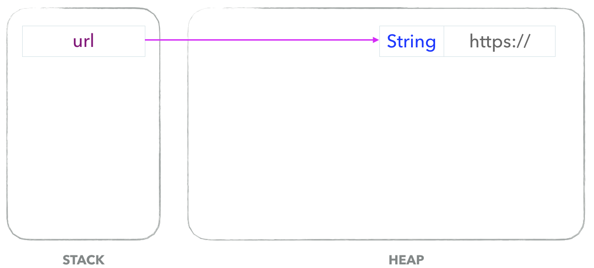
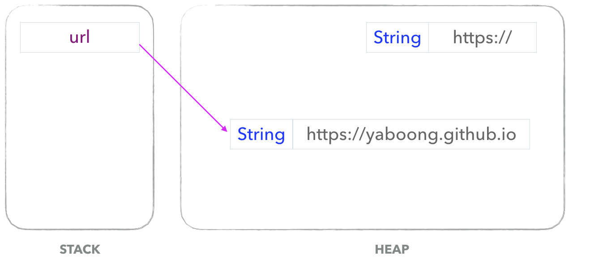
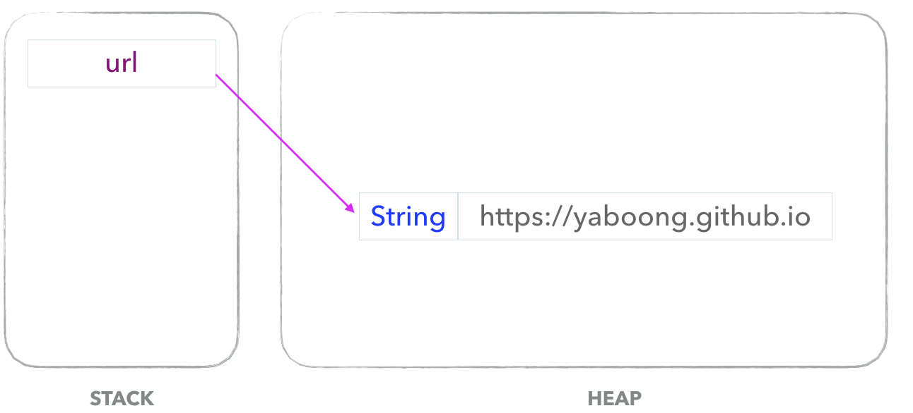

예전 신입 면접에서 명시적으로 사용 후 직접 코드를 통해 반납하지 않은 객체가 어떻게 처리되는지에 대해 질문 받은적이 있었다. 그때는 제대로 대답하지 못했고, 이후에 검색을 통해 가비지컬렉터(GC)의 존재를 알게 되었다. 그리고 오늘은 가비지 컬렉션에 대해 조금 더 자세히 공부하는 기회를 가지고자 한다.

프로그램을 개발 하다 보면 유효하지 않은 메모리인 가바지(Garbage)가 발생하게 된다. C언어를 이용하면 free()라는 함수를 통해 직접 메모리를 해제해주어야 한다. 하지만 Java나 Kotlin을 이용해 개발을 하다 보면 개발자가 메모리를 직접 해제해주는 일이 없다. 그 이유는 JVM의 가비지 컬렉터가 불필요한 메모리를 알아서 정리해주기 때문이다. 대신 Java에서 명시적으로 불필요한 데이터를 표현하기 위해서 일반적으로 null을 선언해준다.

Java나 Kotlin에서는 이러한 메모리 누수를 방지하기 위해 가비지 컬렉터(Garbage Collector, GC)가 주기적으로 검사하여 메모리를 청소해준다.

(물론 Java에서도 System.gc()를 이용해 호출할 수 있지만, 해당 메소드를 호출하는 것은 시스템의 성능에 매우 큰 영향을 미치므로 절대 호출해서는 안된다.)

즉, 나도 모르는 사이에 참조가 사라진 객체의 값(힙 영역)에 대해 가비지 컬렉션이 알아서 정리를 해주고 있었던 것이다...!

출처: https://mangkyu.tistory.com/118, https://yaboong.github.io/java/2018/06/09/java-garbage-collection/
