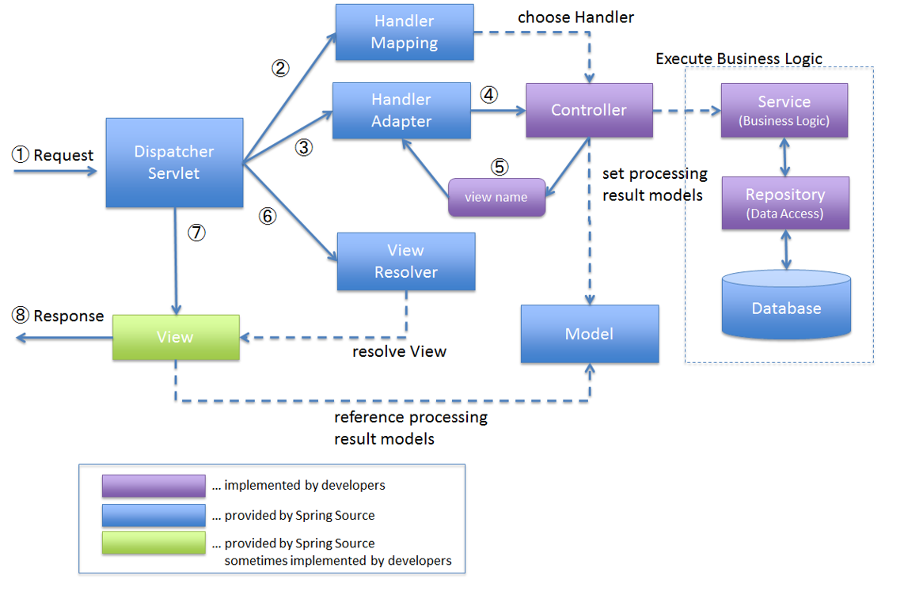
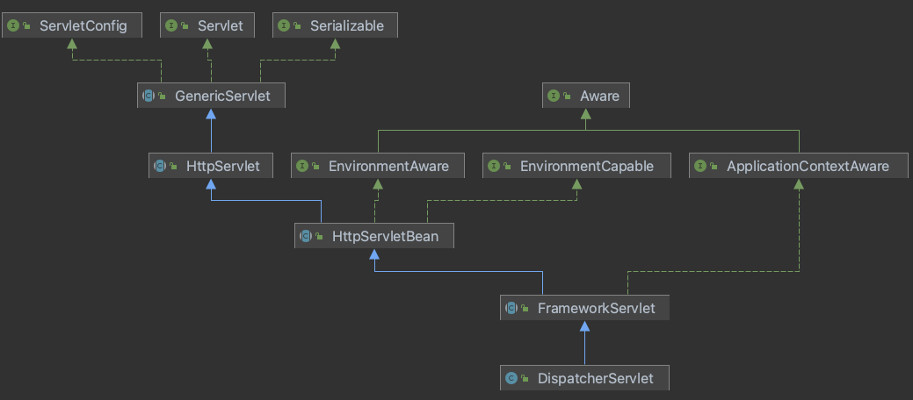

#Spring MVC

###Spring MVC란
* Spring 프레임워크에서 제공하는 웹 모듈이다.  
* MVC 는 Model-View-Controller 의 약자로, 기본 시스템 모듈을 MVC 로 나누어 구현되어있다.  
* Model 은 '데이터' 디자인을 담당한다.
* View 는 '실제로 렌더링되어 보이는 페이지' 를 담당한다.
* Controller 는 사용자의 요청을 받고, 응답을 주는 로직을 담당한다.
* Spring MVC 모듈을 사용하여, 백엔드 프로그래밍의 기본 프레임워크를 잡는다.  
* Web 서버에 특화되어 만들어진 모듈이라, 개발자가 해야할 영역을 더 적게 만들어준다. 즉 기존에 Spring 보다 더 깔끔하고 간편하게 개발 가능.  
* 별다른 말이 없으면 MVC Model 2 아키텍처를 사용하는 것으로 생각한다.

#DispatcherServlet 구조

HttpServlet을 상속받아 사용하며, 서블릿으로 동작한다.  
* DispatcherServlet -> FrameworkServlet -> HttpServletBean -> HttpServlet

스프링 부트 구동시 DispatcherServlet을 서블릿으로 자동등록하며 모든 경로에 대해 매핑한다.

##요청 흐름
1. 서블릿이 호출되면 HpptServlet이 제공하는 service() 메소드가 호출된다.
2. 스프링 MVC는 DispatcherServlet의 부모인 FrameworkServlet에서 service()를 오버라이드 해두었다.
3. FrameworkServlet.service()를 시작으로 여러 메서드가 실행되며 DispatcherServlet.doDispatch()가 호출된다.

(출처 : https://catsbi.oopy.io/f52511f3-1455-4a01-b8b7-f10875895d5b / )

ps. 아무 생각없이 스프링이 제공하는 기능들을 가져다쓰기 보다는 직접 프레임워크에 구현되어 있는 메소드들을 하나씩 분석하는 것이 많은 도움이 되는 듯 하다.