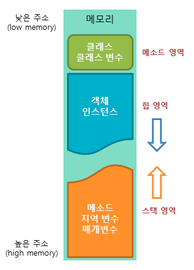

##자바의 메모리 영역

###메소드(Method) 영역  
Static 영역이라고도 하며 전역 변수와 정적 멤버변수(static 변수)가 저장되는 영역

###스택(Stack) 영역  
지역변수, 인자값, 리턴값이 저장되는 영역이고 메소드 안에서 사용되는 기본형 변수들이 값과 함께 저장되고 Heap 영역에 생성된 객체들을 참조하는 주소값이 할당

###힙(Heap) 영역  
자바 프로그램에서 사용되는 모든 인스턴스 변수(객체)들이 저장되는 영역이며 자바에서는 new를 사용하여 객체를 생성하면 힙 영역에 저장. 힙 영역은 메모리 공간이 동적으로 할당되고 해제되며 메모리의 낮은 주소에서부터 높은 주소로 할당

 